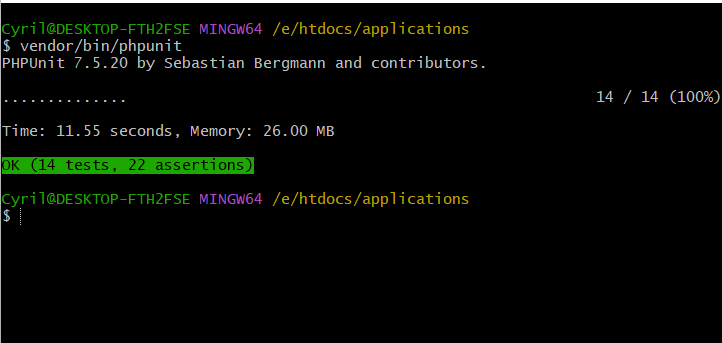

# Job Application Portal - Laravel Application

## Table of Contents

- [Introduction](#introduction)
- [Prerequisites](#prerequisites)
- [Installation](#installation)
- [Features](#features)
- [Folder Structure](#folder-structure)
- [Technologies Used](#technologies-used)
- [Contributing](#contributing)
- [License](#license)
- [Contact](#contact)

## Introduction

Welcome to the Job Application Portal! This web application allows job applicants to apply for job positions in your company seamlessly. The project is built using Laravel on the backend and Vue.js on the frontend, creating a modern and user-friendly experience.


### Prerequisites

- PHP (>= 7.4.0) installed on your system.
- Composer (>= 2.0.0) installed on your system.
- MySQL or any other compatible database server.

## Installation

- Clone this repository to your local machine:
  ```bash
     git clone https://github.com/cgardesey/applications.git
- Navigate to the project directory:
   ```bash
      cd applications
- Create a .env file:
   ```bash
      cp .env.example .env
- Generate the application key:
   ```bash
      php artisan key:generate
- Set up your database credentials in the .env file:
   ```bash
      DB_CONNECTION=mysql
      DB_HOST=127.0.0.1
      DB_PORT=3306
      DB_DATABASE=your_database_name
      DB_USERNAME=your_database_username
      DB_PASSWORD=your_database_password
- Install the dependencies:
   ```bash
      composer install
- Install JavaScript dependencies using npm:
   ```bash
      npm install  
- Run the database migrations and seed the database:
   ```bash
      php artisan migrate --seed
- Compile the frontend assets:
   ```bash
      npm run dev

- You should now be able to access the application at `http://localhost:8000`.


- Run all tests (unit and feature tests):

  ```bash
    # On Windows platform, run:
    vendor\bin\phpunit
  
    # On Unix-like platform, run:
    vendor/bin/phpunit 
All test should pass as shown:




## Features

- **Job Listings**: Companies can post job openings with details such as job title, description, requirements, etc.
- **Job Application**: Applicants can apply for a job by submitting their application along with relevant documents and contact information.
- **Dashboard**: Companies and applicants have their respective dashboards to manage their job postings and applications.
- **Authentication**: Secure login and registration system for both companies and applicants.
- **Responsive UI**: Responsive design for mobile and desktop devices

## Folder Structure

The application follows a standard Laravel folder structure:

- `app`: Contains the core application logic.
- `config`: Contains configuration files.
- `database`: Contains database-related files such as migrations and seeders.
- `public`: Contains the public assets, including CSS, JavaScript, and media files.
- `resources`: Contains the views, language files, and frontend assets.
- `routes`: Contains the application routes.
- `storage`: Contains generated files like logs, uploaded files, etc.
- `tests`: Contains the test cases.


## Technologies Used

- PHP (>= 7.4)
- Composer (https://getcomposer.org/)
- Node.js (>= 14.x)
- npm (>= 6.x)
- Laravel 5.x (PHP framework)
- Vue.js 3.x (JavaScript framework)
- Bootsrap CSS (Utility-first CSS framework)
- MySQL (Database)
- Laravel Mix (Asset compilation)

## Contributing

I welcome contributions to enhance the Job Application Portal. If you find any bugs or have feature suggestions, please open an issue or submit a pull request. Make sure to follow the existing coding style and conventions.

## License

This job application portal is open-source and available under the [MIT License](https://opensource.org/licenses/MIT).

## Contact

If you have any questions or need assistance, please contact me at cyrilgardesey@gmail.com.

Happy coding!

   

